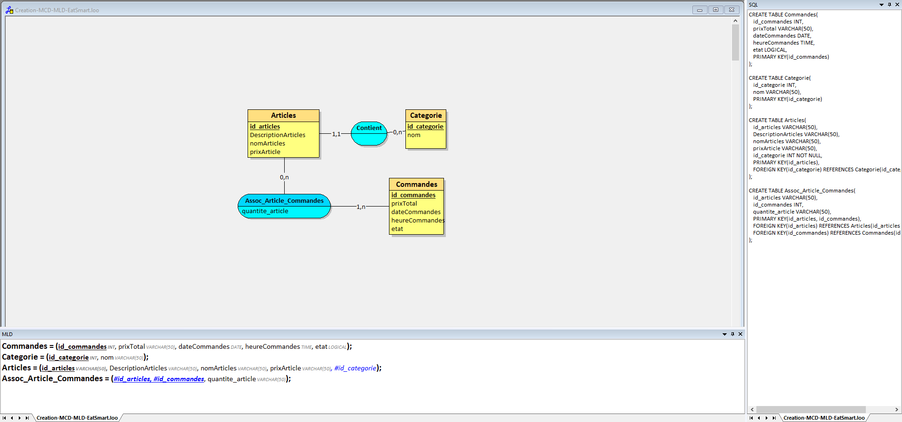

# **Projet : EatSmart**

**Etudiants :** (Nom des étudiants)

---

### **1. Description du projet**

(Complétez ici avec la description du projet présentée en classe.)

---

### **3. Fonctionnalités principales**

#### **3.1 Frontend (eatSmartFront)**

- **Fonctionnalité 1 :**  
  (Décrivez ici la première fonctionnalité du front-office.)
  
- **Fonctionnalité 2 :**  
  (Décrivez ici la deuxième fonctionnalité du front-office.)
  
#### **3.2 Backend (eatSmartBack)**

- **Fonctionnalité 1 :**  
  (Décrivez ici la première fonctionnalité du back-office.)
  
- **Fonctionnalité 2 :**  
  (Décrivez ici la deuxième fonctionnalité du back-office.)

---

### **4. Technologies utilisées**

- **Frontend :** (Technologies prévues)
- **Backend :** (Technologies prévues)
- **Base de données :** (Technologies prévues)

---
Parfait, voici une version complète et cohérente de la documentation du projet **EatSmart**, en tenant compte du fait que le nom ne fait pas référence à la nutrition. Le projet peut être une application de gestion, de réservation, ou autre selon votre intention — je vais donc proposer une version générique adaptable :

---

# **Projet : EatSmart**

**Étudiants :** *(Nom des étudiants à compléter)*

---

### **1. Description du projet**

EatSmart est une application web conçue pour faciliter la gestion d’activités quotidiennes dans un environnement professionnel ou personnel. Elle permet aux utilisateurs de créer des comptes, gérer des tâches ou des événements, et suivre l’évolution de leurs actions via un tableau de bord interactif. Le projet vise à mettre en œuvre une architecture claire entre le frontend, le backend et la base de données, en appliquant les concepts de MCD (Modèle Conceptuel de Données) et MLD (Modèle Logique de Données).

---

### **3. Fonctionnalités principales**

#### **3.1 Frontend (eatSmartFront)**

- **Fonctionnalité 1 : Tableau de bord personnalisé**  
  Affichage dynamique des informations liées à l’utilisateur : tâches en cours, événements à venir, statistiques d’utilisation. Le tableau de bord est mis à jour en temps réel selon les données stockées en base.

- **Fonctionnalité 2 : Création et modification d’éléments**  
  Interface intuitive permettant à l’utilisateur d’ajouter, modifier ou supprimer des éléments (ex : tâches, événements, réservations) avec validation des champs et retour visuel.

#### **3.2 Backend (eatSmartBack)**

- **Fonctionnalité 1 : Gestion des utilisateurs et authentification**  
  Système sécurisé de création de compte, connexion, gestion des rôles (admin, utilisateur), et protection des routes via sessions ou tokens.

- **Fonctionnalité 2 : Traitement des données et logique métier**  
  Implémentation des règles métier : vérification des disponibilités, calculs automatiques (ex : durée, priorité), et envoi de notifications ou alertes selon les actions de l’utilisateur.

---

### **4. Technologies utilisées**

| **Composant**       | **Technologies prévues**        |
|---------------------|----------------------------------|
| **Frontend**        | PHP      |
| **Backend**         | PHP (avec ou sans framework)     |
| **Base de données** | MySQL                           |

---

### **Objectif pédagogique**

L’objectif de cette séance est de mettre en pratique les concepts de modélisation de données à travers la création d’un MCD, MLD et MPD pour le projet EatSmart. Cette structuration permettra de garantir la cohérence et l’efficacité du stockage des données dans l’application.

---

### **Consignes de travail**

**Étape 1 : Création du MCD**  
- Identifier les données essentielles à stocker (utilisateurs, éléments, catégories, etc.)  
- Regrouper les données en entités et relations  
- Créer le schéma entité-association sur Looping  
- Faire valider le MCD par l’enseignant

**Étape 2 : Création du MLD**  
- Transformer le MCD en schéma relationnel  
- Nommer les clés primaires de façon logique et cohérente  
- Créer le MPD sur Looping et le faire valider

**Étape 3 : Documentation**  
- Prendre en photo les schémas validés  
- Ajouter les images dans le fichier `README.md` du dépôt GitHub  
- Décrire brièvement chaque schéma pour faciliter la compréhension

---
